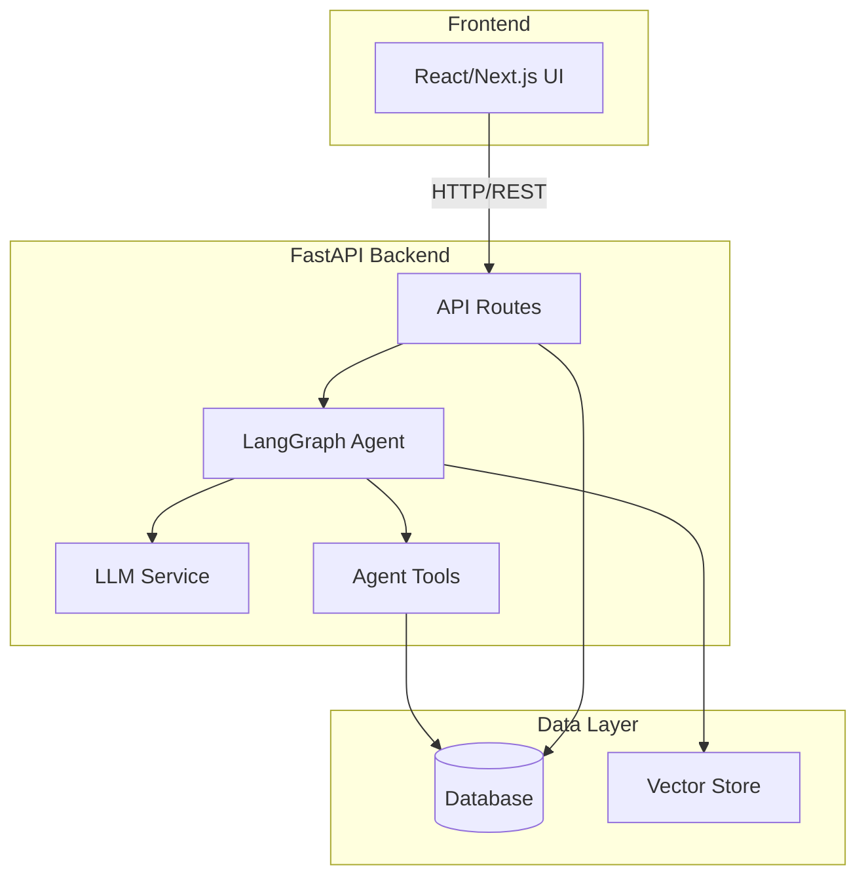
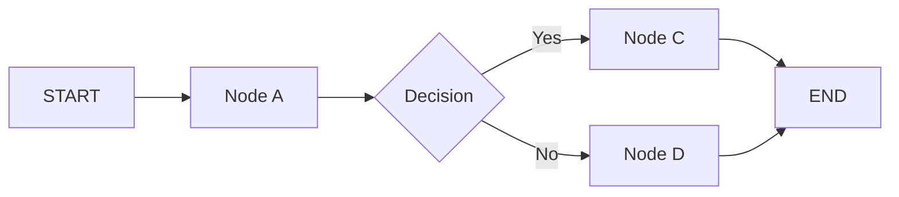
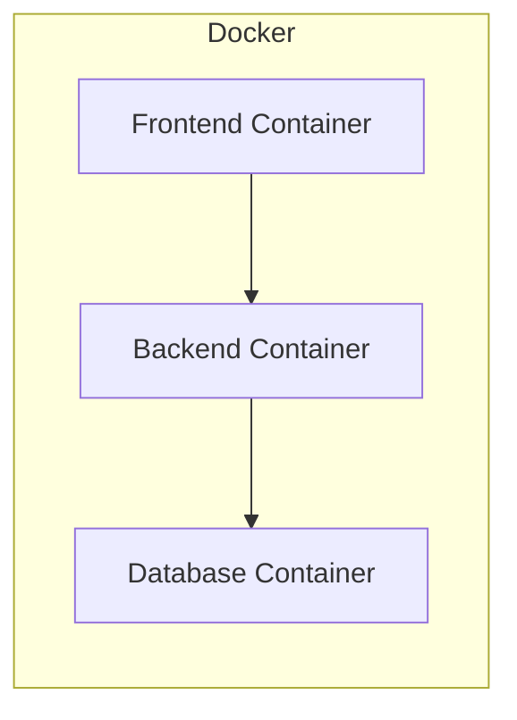

# Architecture Document

## System Overview

[Tóm tắt 2-3 câu về kiến trúc hệ thống]

## Architecture Diagram

## Components

### 1. Frontend (React/Next.js)
- **Purpose:** [mô tả]
- **Key Features:** [danh sách]
- **State Management:** [approach]

### 2. Backend (FastAPI)
- **Purpose:** [mô tả]
- **API Design:** RESTful
- **Authentication:** [JWT/None]

### 3. AI Agent (LangGraph)
- **Agent Type:** [ReAct / Plan-and-Execute / Custom]
- **State:** [mô tả state schema]
- **Nodes:** [danh sách nodes]
- **Tools:** [danh sách tools]
- **Flow:**

### 4. Database
- **Type:** [PostgreSQL / SQLite]
- **Tables:** [danh sách]
- **Migrations:** Alembic

### 5. Vector Store
- **Type:** [ChromaDB / FAISS / Pinecone]
- **Embeddings:** [model]
- **Purpose:** [RAG / similarity search]

## Data Flow

1. User gửi request từ Frontend
2. API route nhận và validate input
3. Agent xử lý qua LangGraph pipeline
4. LLM generate response
5. Tools thực thi actions (nếu cần)
6. Response trả về Frontend

## Deployment Architecture

## Security

- API keys stored in `.env` (never commit)
- Input validation via Pydantic
- Rate limiting on API endpoints
- CORS configured for frontend domain

## Design Decisions

| Decision | Choice | Reason |
|----------|--------|--------|
| Framework | FastAPI | Async, auto-docs, type-safe |
| Agent | LangGraph | Flexible state management |
| Database | [choice] | [reason] |
| Frontend | Next.js | [reason] |
