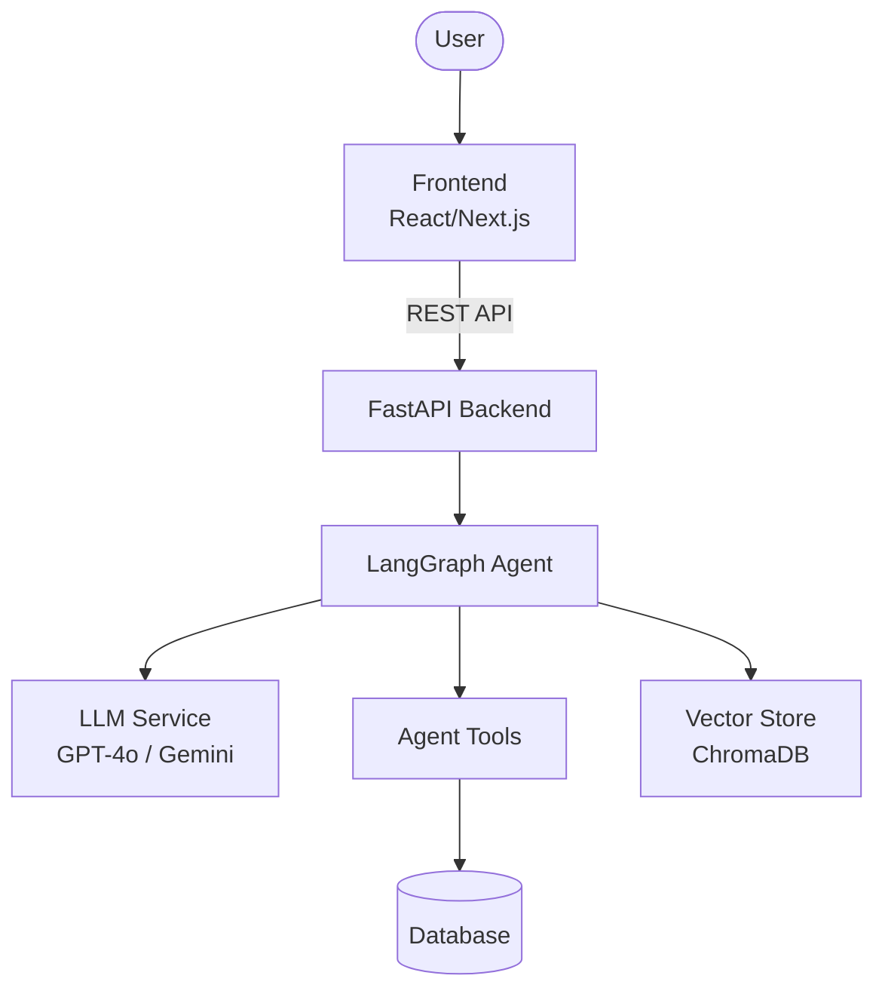
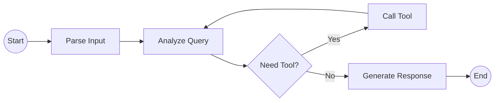

# Architecture Diagram

## System Overview

## Agent Flow

## Component Details

| Component | Technology | Purpose |
|-----------|-----------|---------|
| Frontend | React/Next.js | User interface |
| Backend | FastAPI | API server |
| Agent | LangGraph | AI agent orchestration |
| LLM | OpenAI/Gemini | Language model |
| Database | PostgreSQL/SQLite | Data persistence |
| Vector Store | ChromaDB | RAG / embeddings |
