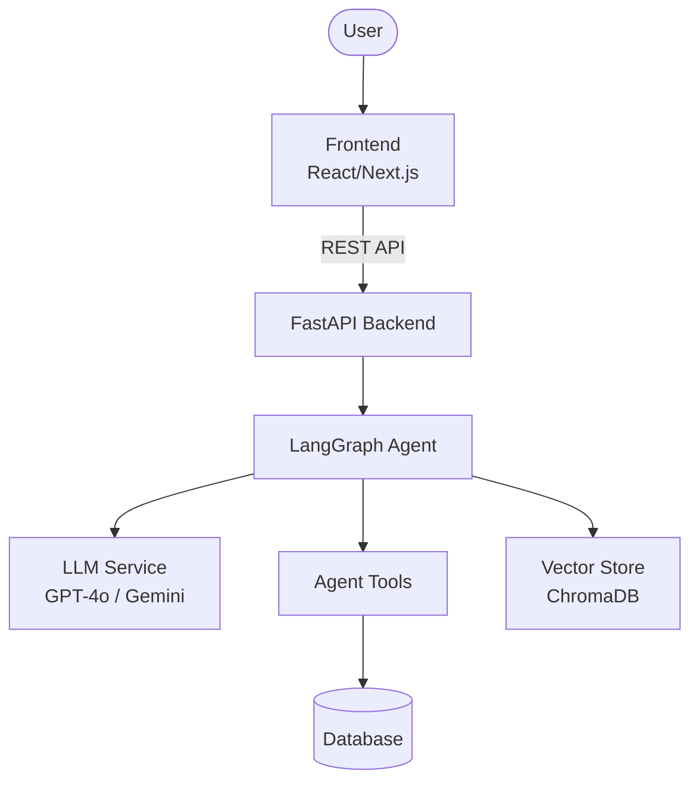

## System Architecture

### Overview Diagram

## Components

### 1. Frontend (React/Next.js)

- **Purpose:** User interface cho sản phẩm
- **Key Features:** Responsive, dark mode, realtime
- **State Management:** React hooks / Zustand

### 2. Backend (FastAPI)

- **Purpose:** API server xử lý business logic
- **API Design:** RESTful endpoints
- **Auth:** JWT (nếu cần)

### 3. AI Agent (LangGraph)

- **Agent Type:** ReAct / Plan-and-Execute / Custom
- **State:** TypedDict schema
- **Nodes:** Xử lý từng bước trong pipeline
- **Tools:** Search, calculate, API calls

### 4. Database

- **Type:** PostgreSQL (production) / SQLite (dev)
- **ORM:** SQLAlchemy (nếu cần)
- **Migrations:** Alembic (nếu cần)

### 5. Vector Store

- **Type:** ChromaDB (local) / Pinecone (cloud)
- **Embeddings:** OpenAI embeddings
- **Purpose:** RAG / similarity search

## Data Flow

1. User gửi request từ Frontend
2. API route nhận và validate input (Pydantic)
3. Agent xử lý qua LangGraph pipeline
4. LLM generate response
5. Tools thực thi actions (nếu cần)
6. Response trả về Frontend qua API

## Design Decisions

| Decision | Choice | Reason |
|----------|--------|--------|
| Framework | FastAPI | Async, auto-docs, type-safe |
| Agent | LangGraph | Flexible state machine |
| Database | SQLite→PostgreSQL | Dev dễ, prod mạnh |
| Frontend | Next.js | Full-stack ready |
