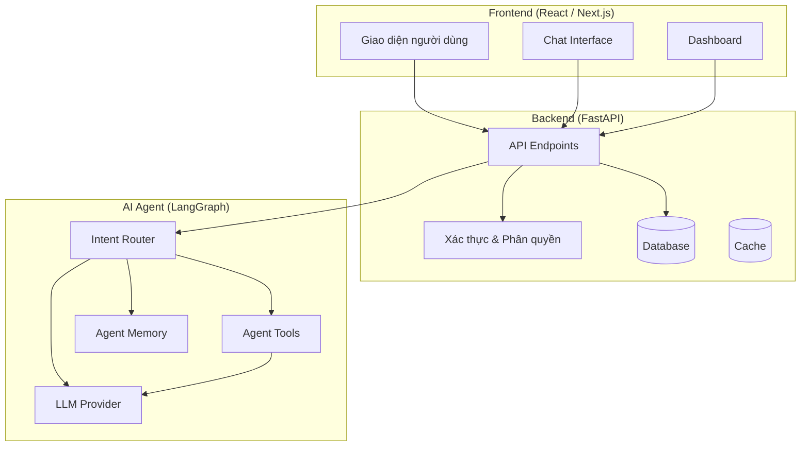
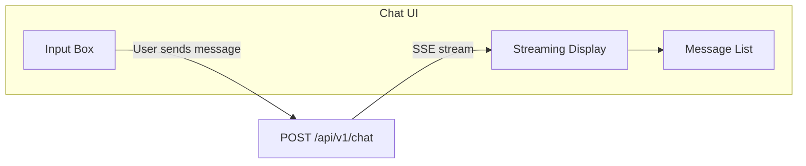
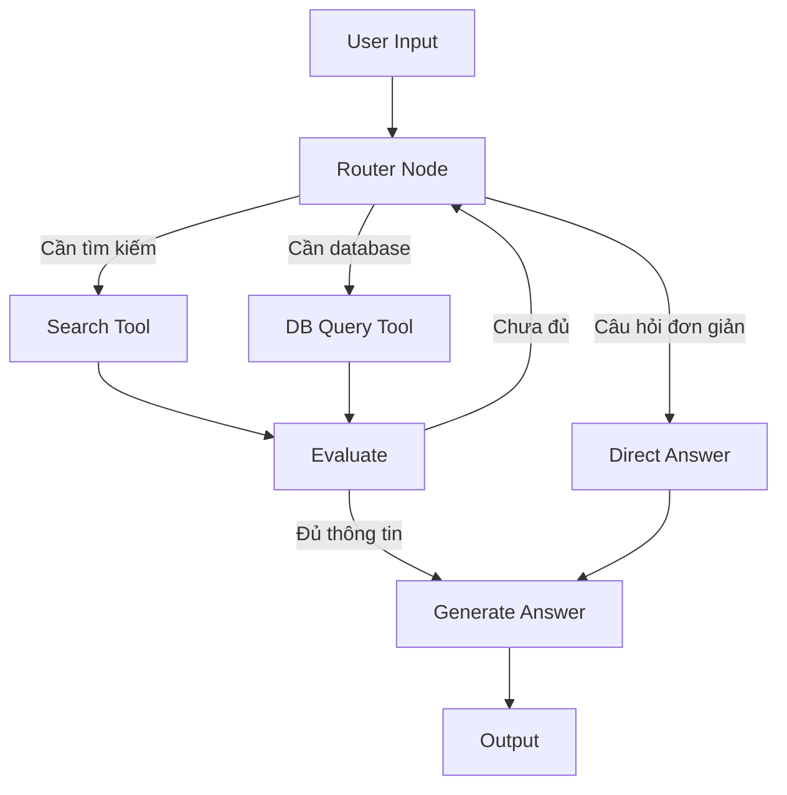
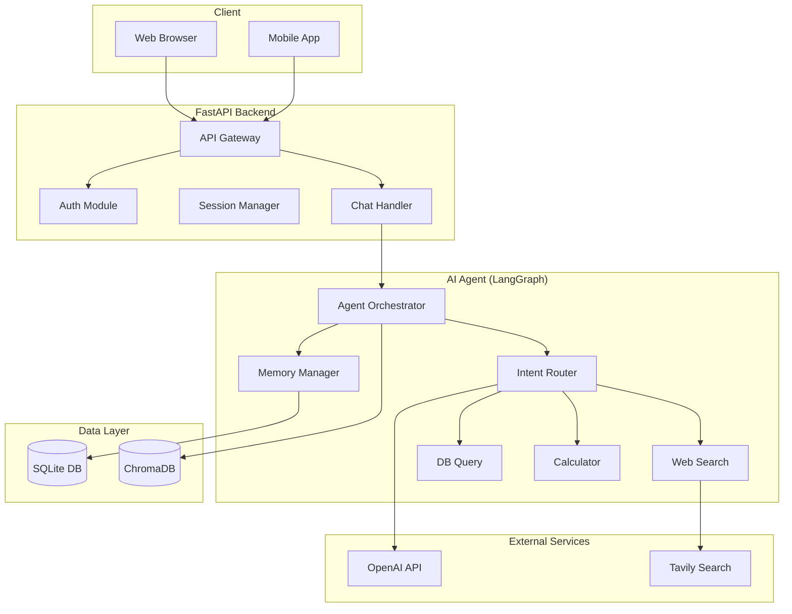
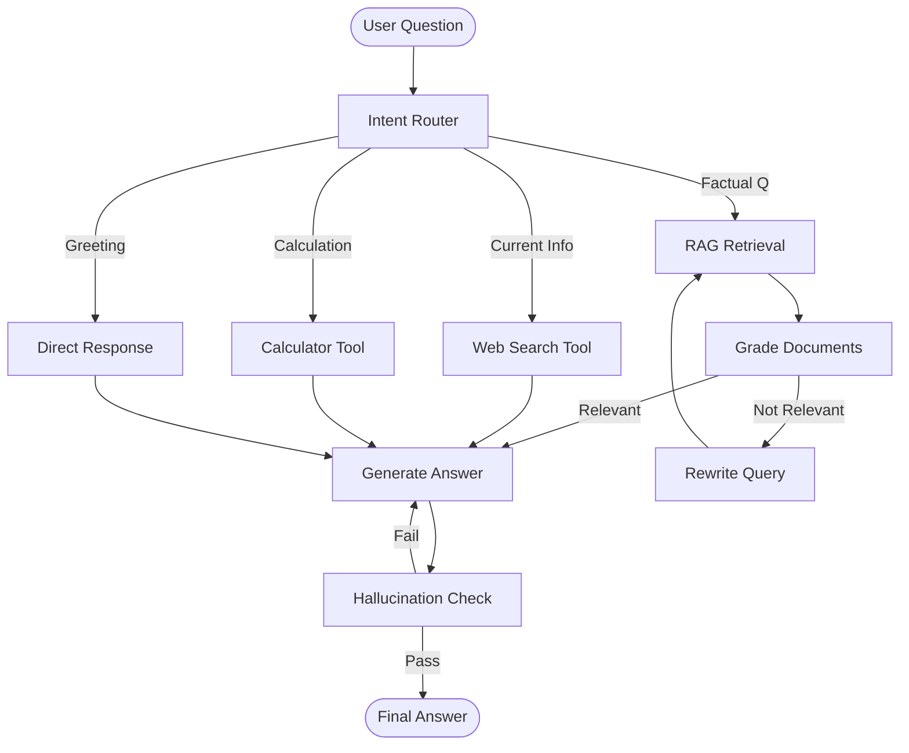
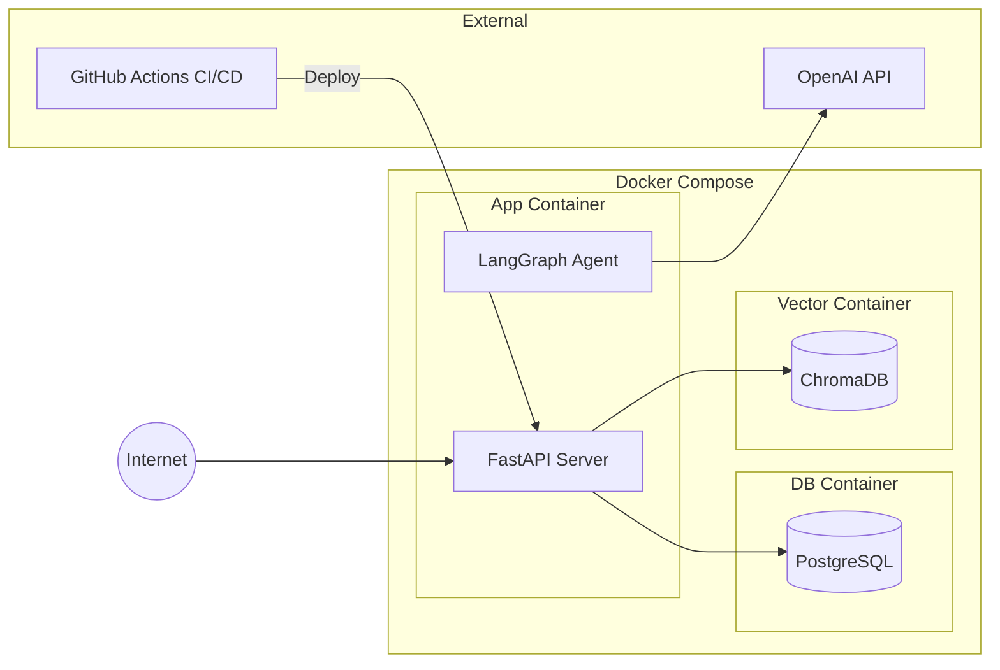

## Tổng quan kiến trúc 3 tầng — Nhìn bức tranh toàn cảnh

Trước khi viết một dòng code nào cho Agent logic, bạn cần trả lời câu hỏi quan trọng nhất: **hệ thống của bạn sẽ có cấu trúc như thế nào?** Kiến trúc hệ thống giống như bản đồ xây dựng — nó cho bạn biết mỗi thành phần nằm ở đâu, giao tiếp với nhau ra sao, và dữ liệu chảy qua hệ thống theo đường nào. Thiết kế kiến trúc tốt giúp bạn phát triển nhanh, bảo trì dễ, và mở rộng (scale) khi cần. Thiết kế kiến trúc tồi dẫn đến code rối, bug nhiều, và phải viết lại từ đầu.

Phần lớn các ứng dụng AI Agent hiện đại sử dụng **kiến trúc 3 tầng** (three-tier architecture), bao gồm Frontend, Backend, và AI Agent. Mỗi tầng có trách nhiệm riêng, giao tiếp với tầng khác thông qua API rõ ràng. Tách biệt này mang lại nhiều lợi ích: bạn có thể thay đổi Frontend mà không ảnh hưởng Agent logic, nâng cấp Agent mà không cần deploy lại Frontend, và scale từng tầng độc lập.

Sơ đồ dưới đây minh họa kiến trúc tổng thể:



**Frontend** là tầng người dùng tương tác trực tiếp. Nó gửi HTTP requests đến Backend và hiển thị kết quả. Trong ngữ cảnh AI Agent, Frontend thường có dạng chat interface (giao diện trò chuyện) nơi người dùng nhập câu hỏi và nhận câu trả lời từ Agent. Frontend cũng có thể bao gồm dashboard hiển thị thống kê, lịch sử hội thoại, và các tính năng quản lý.

**Backend** là "trạm trung chuyển" — nó nhận requests từ Frontend, xử lý business logic (xác thực, phân quyền, validate dữ liệu), gọi AI Agent khi cần, lưu trữ dữ liệu vào database, và trả kết quả về Frontend. Backend là nơi bạn kiểm soát ai được dùng hệ thống, giới hạn rate (rate limiting), và log lại mọi hoạt động.

**AI Agent** là "bộ não" của hệ thống. Nó nhận câu hỏi từ Backend (được forwarding từ Frontend), xử lý qua state machine (LangGraph), sử dụng tools nếu cần (tìm kiếm web, truy vấn database, gọi API bên ngoài), và trả về câu trả lời. Agent không giao tiếp trực tiếp với người dùng — mọi giao tiếp đều thông qua Backend.

Tại sao lại tách làm 3 tầng thay vì gộp tất cả vào một? Có ba lý do chính:

**Thứ nhất, separation of concerns (tách biệt trách nhiệm).** Mỗi tầng chỉ lo một việc. Frontend chỉ lo hiển thị. Backend chỉ lo business logic và data. Agent chỉ lo AI reasoning. Khi bạn cần sửa một bug ở giao diện, bạn không cần đọc code Agent. Khi bạn cần tối ưu Agent logic, bạn không cần đụng vào Frontend.

**Thứ hai, scalability (khả năng mở rộng).** Trong thực tế, AI Agent thường là điểm nghẽn (bottleneck) vì LLM inference mất thời gian. Với kiến trúc 3 tầng, bạn có thể scale Agent layer riêng bằng cách chạy nhiều Agent instance, mà không cần thêm resource cho Frontend hay Backend. Tương tự, nếu có 1000 users truy cập đồng thời, bạn scale Frontend và Backend, không cần thêm Agent instances.

**Thứ ba, technology flexibility (linh hoạt công nghệ).** Bạn có thể thay đổi Frontend từ React sang Vue mà không ảnh hưởng Backend hay Agent. Bạn có thể đổi LLM provider từ OpenAI sang Anthropic mà không cần đụng đến Frontend. Mỗi tầng có thể chọn công nghệ phù hợp nhất cho nhiệm vụ của nó.

> 🔑 **ĐIỂM CHÍNH:** Kiến trúc 3 tầng không phải over-engineering — nó là baseline. Thậm chí nếu dự án nhỏ, việc tách biệt rõ ràng giữa Frontend, Backend, và Agent sẽ giúp bạn phát triển nhanh hơn và ít bug hơn. Kinh nghiệm cho thấy các đội có kiến trúc rõ ràng luôn đạt kết quả tốt hơn đáng kể so với các đội gộp tất cả vào một file.

## Frontend (React/Next.js) — Giao diện cho AI Agent

Frontend là "mặt tiền" của ứng dụng — thứ mà người dùng thấy và tương tác. Đối với AI Agent application, Frontend thường có hai loại giao diện chính: **chat interface** (giao diện trò chuyện, giống ChatGPT) và **dashboard** (bảng điều khiển hiển thị dữ liệu, thống kê, và kết quả phân tích).

### Tại sao chọn React/Next.js?

React là thư viện JavaScript phổ biến nhất thế giới để xây dựng giao diện người dùng, với ecosystem khổng lồ và cộng đồng hỗ trợ mạnh mẽ. Next.js là framework xây dựng trên nền React, thêm các tính năng như server-side rendering (SSR), static site generation (SSG), và API routes.

Đối với dự án AI20K, bạn không bắt buộc phải dùng React/Next.js — bạn có thể dùng Streamlit, Gradio, hoặc thậm chí terminal UI. Tuy nhiên, React/Next.js mang lại lợi thế:

- **Streaming response:** AI Agent thường trả lời từng token (streaming). React xử lý streaming tốt hơn Streamlit.
- **Tùy chỉnh hoàn toàn:** Bạn có thể thiết kế giao diện chính xác như muốn, không bị giới hạn bởi template của Streamlit hay Gradio.
- **Production-ready:** Nếu dự án tiếp tục phát triển sau AI20K, React/Next.js là lựa chọn mà hầu hết công ty sử dụng.

### Server-Side Rendering vs Client-Side Rendering

Khi dùng Next.js, bạn cần hiểu hai chế độ rendering chính:

**Server-Side Rendering (SSR):** Trang HTML được render trên server và gửi đến trình duyệt. Phù hợp cho trang nội dung tĩnh, cần SEO tốt (blog, landing page). Trong AI Agent app, SSR phù hợp cho trang chủ, trang giới thiệu, và dashboard hiển thị dữ liệu lịch sử.

**Client-Side Rendering (CSR):** Trang HTML gần như trống, JavaScript chạy trên trình duyệt để render nội dung. Phù hợp cho interactive app, đặc biệt là chat interface. Khi bạn chat với Agent, CSR cho phép cập nhật giao diện real-time mà không cần reload trang.

Trong thực tế, AI Agent app thường kết hợp cả hai: SSR cho các trang public, CSR cho chat interface. Next.js hỗ trợ cả hai chế độ trong cùng một ứng dụng thông qua App Router.

### Thiết kế Chat Interface

Chat interface là core feature của AI Agent app. Dưới đây là các thành phần chính:



**Input Box** — Nơi người dùng nhập câu hỏi. Nên hỗ trợ multi-line (nhiều dòng) và gửi bằng Enter (Shift+Enter cho dòng mới). Có thể thêm nút upload file nếu Agent hỗ trợ xử lý tài liệu.

**Message List** — Hiển thị lịch sử hội thoại. Mỗi message có role (user hoặc assistant), content (nội dung), và timestamp. Nên auto-scroll xuống tin nhắn mới nhất. Hỗ trợ Markdown rendering cho câu trả lời của Agent (code blocks, tables, bold/italic).

**Streaming Display** — Hiển thị câu trả lời của Agent từng token (streaming) thay vì đợi toàn bộ câu trả lời. Điều này cải thiện trải nghiệm người dùng đáng kể — họ thấy Agent đang "suy nghĩ" và trả lời dần dần, thay vì nhìn màn hình trống trong 10-15 giây.

> 💡 **MẸO:** Nếu thời gian có hạn, hãy bắt đầu với Streamlit cho prototype nhanh, sau đó migrate sang React/Next.js cho production. Streamlit cho phép bạn tạo giao diện chat cơ bản trong vài dòng code Python, phù hợp cho demo nội bộ. Nhưng khi cần giao diện polished cho Demo Day, React/Next.js là lựa chọn tốt hơn.

### Khi nào Frontend "đủ tốt"?

Trong khuôn khổ AI20K, Frontend không phải tiêu chí đánh giá chính — Agent logic và Backend quan trọng hơn. Frontend "đủ tốt" khi:

- Người dùng có thể nhập câu hỏi và nhận câu trả lời.
- Streaming response hiển thị đúng.
- Error messages hiển thị thân thiện (không hiển thị stack trace).
- Giao diện responsive (hoạt động trên cả mobile).
- Có indicator khi Agent đang xử lý (loading spinner hoặc "typing...").

Đừng dành quá nhiều thời gian cho UI polish. Một giao diện đơn giản nhưng hoạt động ổn định tốt hơn một giao diện đẹp nhưng đầy bug.

## Backend (FastAPI) — Xương sống của hệ thống

Backend là tầng kết nối Frontend và AI Agent, đồng thời xử lý tất cả business logic không liên quan đến AI reasoning: xác thực người dùng, quản lý session, lưu trữ lịch sử chat, rate limiting, logging, và error handling. FastAPI là framework được chọn cho Backend vì nhiều lý do thuyết phục.

### Tại sao chọn FastAPI?

**Hiệu năng async tự nhiên.** FastAPI xây dựng trên nền Starlette và hỗ trợ async/await ngay từ đầu. Trong ứng dụng AI Agent, bạn thường cần gọi LLM API (mất vài giây), gọi external tools (mất vài trăm mili-giây), và xử lý nhiều requests đồng thời. Async cho phép server xử lý request khác trong khi chờ LLM phản hồi, thay vì block (chặn) toàn bộ server.

**Tự động sinh API documentation.** FastAPI sử dụng OpenAPI specification (trước đây gọi là Swagger) để tự động sinh interactive API docs tại `/docs` (Swagger UI) và `/redoc` (ReDoc). Điều này có nghĩa là mỗi khi bạn thêm endpoint mới, documentation tự động cập nhật — không cần viết docs thủ công. Các đội dùng FastAPI thường có tài liệu API tốt hơn hẳn so với phải viết docs bằng tay.

**Type safety với Pydantic.** Mỗi request và response được validate tự động bởi Pydantic models. Nếu client gửi dữ liệu sai format (ví dụ: gửi string thay vì integer cho field `limit`), FastAPI tự động trả về error 422 với thông báo chi tiết. Điều này giảm thiểu bug do data type mismatch — một lỗi rất phổ biến.

**Hỗ trợ Server-Sent Events (SSE).** SSE cho phép server push data đến client liên tục, lý tưởng cho streaming response từ LLM. Thay vì đợi Agent trả lời xong rồi gửi toàn bộ response, bạn có thể stream từng chunk đến Frontend, tạo trải nghiệm "typing effect" giống ChatGPT.

### Cấu trúc API cho AI Agent

Dưới đây là các API endpoints phổ biến cho ứng dụng AI Agent:

```python
from fastapi import FastAPI, HTTPException
from pydantic import BaseModel, Field
from typing import AsyncGenerator
from fastapi.responses import StreamingResponse

app = FastAPI(title="AI Agent API", version="0.1.0")


class ChatRequest(BaseModel):
    """Schema cho request gửi đến Agent."""
    message: str = Field(..., min_length=1, max_length=10000,
                         description="Câu hỏi của người dùng")
    session_id: str | None = Field(None, description="ID phiên hội thoại")
    stream: bool = Field(True, description="Bật/tắt streaming response")


class ChatResponse(BaseModel):
    """Schema cho response từ Agent."""
    answer: str
    session_id: str
    sources: list[str] = Field(default_factory=list)
    metadata: dict = Field(default_factory=dict)


@app.post("/api/v1/chat", response_model=ChatResponse)
async def chat(request: ChatRequest) -> ChatResponse:
    """Gửi câu hỏi đến AI Agent và nhận câu trả lời."""
    # Logic gọi Agent sẽ ở đây
    ...


@app.post("/api/v1/chat/stream")
async def chat_stream(request: ChatRequest) -> StreamingResponse:
    """Stream response từ Agent (SSE)."""
    async def generate() -> AsyncGenerator[str, None]:
        # Stream từng chunk từ Agent
        async for chunk in agent.astream(request.message):
            yield f"data: {chunk}\n\n"

    return StreamingResponse(
        generate(),
        media_type="text/event-stream"
    )


@app.get("/api/v1/health")
async def health_check():
    """Health check endpoint."""
    return {"status": "healthy", "version": "0.1.0"}
```

Phân tích cấu trúc trên:

**Pydantic models (BaseModel)** đóng vai trò "hợp đồng" giữa client và server. `ChatRequest` định nghĩa chính xác dữ liệu gửi lên phải có dạng gì: `message` bắt buộc (không null), từ 1-10000 ký tự; `session_id` tùy chọn; `stream` mặc định là True. Nếu client gửi request không hợp lệ, FastAPI tự động trả về lỗi 422 với mô tả chi tiết — bạn không cần viết validation code thủ công.

**Async endpoints** (`async def`) cho phép server xử lý nhiều requests đồng thời. Khi một request đang chờ LLM phản hồi, server có thể nhận và xử lý request khác. Nếu bạn dùng `def` thay vì `async def`, mỗi request sẽ block một worker, và server có thể bị "đóng băng" nếu có nhiều users chat cùng lúc.

**Streaming endpoint** sử dụng Server-Sent Events (SSE) để push từng chunk của Agent response đến client. Điều này cải thiện UX đáng kể — thay vì đợi 10-15 giây cho Agent hoàn thành, người dùng thấy câu trả lời xuất hiện từng phần, giống ChatGPT.

### Error handling trong FastAPI

```python
from fastapi import HTTPException
from src.core.config import settings


@app.post("/api/v1/chat")
async def chat(request: ChatRequest):
    try:
        response = await agent.run(request.message)
        return ChatResponse(
            answer=response.content,
            session_id=request.session_id or str(uuid4()),
        )
    except LLMRateLimitError:
        raise HTTPException(
            status_code=429,
            detail="Agent đang quá tải. Vui lòng thử lại sau vài giây."
        )
    except LLMAuthError:
        if settings.app_env == "development":
            raise HTTPException(
                status_code=500,
                detail="API key không hợp lệ. Kiểm tra lại .env file."
            )
        raise HTTPException(
            status_code=500,
            detail="Lỗi cấu hình hệ thống. Vui lòng liên hệ admin."
        )
    except Exception as e:
        logger.error(f"Unexpected error: {e}")
        raise HTTPException(
            status_code=500,
            detail="Đã xảy ra lỗi không mong muốn. Vui lòng thử lại."
        )
```

Error handling phải phân biệt giữa môi trường development và production. Trong development, bạn muốn hiển thị thông tin chi tiết để debug. Trong production, bạn chỉ hiển thị thông báo thân thiện, không tiết lộ chi tiết kỹ thuật (đề phòng lộ thông tin nhạy cảm).

> ⚠️ **LƯU Ý:** Không bao giờ hiển thị Python stack trace hay internal error message cho end user. Trong production, log chi tiết vào file log (hoặc monitoring system), chỉ trả về generic error message. Thông tin như database connection string hay API key có thể bị lộ qua error message nếu bạn không cẩn thận.

## AI Agent (LangGraph) — Bộ não của hệ thống

AI Agent là tầng cốt lõi — nơi diễn ra "suy nghĩ" của hệ thống. Agent nhận câu hỏi từ Backend, xử lý qua một quy trình nhiều bước (state machine), sử dụng tools khi cần, và trả về câu trả lời. LangGraph là framework được chọn để xây dựng Agent vì cách tiếp cận duy nhất: **state machine (máy trạng thái)** thay vì linear chain (chuỗi tuyến tính).

### Tại sao không dùng LangChain thông thường?

Nếu bạn đã tìm hiểu về LangChain, bạn có thể hỏi: tại sao không dùng LangChain chain (LCEL) đơn giản thay vì LangGraph? Câu trả lời nằm ở sự khác biệt giữa **chain** và **state machine**:

**Chain (chuỗi tuyến tính):** Input → Step A → Step B → Step C → Output. Luôn đi theo đúng thứ tự này, không có rẽ nhánh, không có loop, không có điều kiện. Phù hợp cho các task đơn giản như: "Dịch câu này sang tiếng Anh" hoặc "Tóm tắt đoạn văn bản này."

**State machine (máy trạng thái):** Input → State A → (điều kiện?) → State B hoặc State C → (cần thêm thông tin?) → quay lại State A → ... → Output. Có rẽ nhánh dựa trên điều kiện, có loop (vòng lặp), và có thể dừng giữa chờ input. Phù hợp cho các task phức tạp như: "Trả lời câu hỏi của user, nhưng nếu cần thêm thông tin thì hỏi lại, nếu cần tìm kiếm thì dùng tool, nếu câu trả lời chưa đủ tốt thì suy nghĩ lại."

Hầu hết các ứng dụng AI Agent thực tế đều yêu cầu state machine, không phải chain đơn giản. Ví dụ: Agent cần quyết định xem câu hỏi của user có cần tìm kiếm web không, có cần truy vấn database không, hay có thể trả lời trực tiếp bằng kiến thức của LLM. Sau khi tìm kiếm, Agent cần quyết định xem thông tin đã đủ để trả lời chưa hay cần tìm thêm. Đây là **agentic loop** — Agent lặp lại quy trình "suy nghĩ → hành động → quan sát" cho đến khi có câu trả lời thỏa đáng.

### State machine với LangGraph

LangGraph cho phép bạn định nghĩa Agent dưới dạng một **directed graph** (đồ thị có hướng), trong đó mỗi node là một bước xử lý, mỗi edge là đường chuyển trạng thái, và **state** là dữ liệu được truyền giữa các node.



Sơ đồ trên minh họa một Agent đơn giản nhưng thực tế. Khi nhận câu hỏi, Router Node phân loại và quyết định luồng xử lý:

- Nếu là câu hỏi đơn giản (ví dụ: "Xin chào"), trả lời trực tiếp.
- Nếu cần thông tin hiện tại (ví dụ: "Thời tiết hôm nay thế nào?"), dùng Search Tool.
- Nếu cần dữ liệu nội bộ (ví dụ: "Doanh thu tháng trước bao nhiêu?"), dùng DB Query Tool.
- Sau khi thu thập thông tin, Evaluate node kiểm tra xem đã đủ chưa. Nếu chưa, quay lại Router. Nếu đủ, Generate Answer.

Ví dụ code định nghĩa graph cơ bản:

```python
from langgraph.graph import StateGraph, END
from typing import TypedDict, Annotated
import operator


class AgentState(TypedDict):
    """State schema — dữ liệu truyền giữa các node."""
    messages: Annotated[list, operator.add]  # Lịch sử tin nhắn
    question: str          # Câu hỏi gốc
    context: list[str]     # Context đã thu thập
    tool_calls: int        # Số lần gọi tools (giới hạn)
    needs_search: bool     # Flag: có cần tìm kiếm không
    answer: str            # Câu trả lời cuối cùng


def router_node(state: AgentState) -> AgentState:
    """Phân loại câu hỏi và quyết định luồng xử lý."""
    question = state["question"]
    # Gọi LLM để phân loại
    classification = llm.invoke(
        f"Phân loại câu hỏi sau: '{question}'\n"
        f"Trả lời một trong: simple, search, database"
    )
    needs_search = "search" in classification.lower()
    return {"needs_search": needs_search}


def search_node(state: AgentState) -> AgentState:
    """Tìm kiếm web và thêm kết quả vào context."""
    results = search_tool.invoke(state["question"])
    return {"context": [results], "tool_calls": state["tool_calls"] + 1}


def generate_node(state: AgentState) -> AgentState:
    """Tạo câu trả lời dựa trên context đã thu thập."""
    context_str = "\n".join(state["context"]) if state["context"] else ""
    answer = llm.invoke(
        f"Dựa trên context sau:\n{context_str}\n\n"
        f"Trả lời câu hỏi: {state['question']}"
    )
    return {"answer": answer}


# Xây dựng graph
graph = StateGraph(AgentState)

# Thêm nodes
graph.add_node("router", router_node)
graph.add_node("search", search_node)
graph.add_node("generate", generate_node)

# Thêm edges (đường chuyển)
graph.set_entry_point("router")
graph.add_conditional_edges(
    "router",
    lambda state: "search" if state["needs_search"] else "generate",
    {"search": "search", "generate": "generate"}
)
graph.add_edge("search", "generate")
graph.add_edge("generate", END)

# Compile
agent = graph.compile()
```

Đây là ví dụ đơn giản nhưng minh họa rõ nguyên tắc: **mỗi node là một hàm nhận state, xử lý, và trả về state mới**. Graph định nghĩa thứ tự thực thi và điều kiện rẽ nhánh. State được truyền tự động giữa các node — bạn không cần quản lý thủ công.

> 🔑 **ĐIỂM CHÍNH:** Sức mạnh của LangGraph nằm ở khả năng định nghĩa **luồng xử lý có điều kiện và vòng lặp**. Agent không chỉ chạy tuần tự A → B → C mà có thể "quay lại" nếu cần thêm thông tin, "rẽ nhánh" tùy theo loại câu hỏi, và "dừng" khi đã có câu trả lời đủ tốt. Đây là sự khác biệt giữa một chatbot đơn giản và một AI Agent thực thụ.

## Cơ sở dữ liệu — Khi nào cần và chọn cái nào

Nhiều sinh viên mặc định rằng mọi ứng dụng đều cần database. Thực tế không phải vậy. Đối với AI Agent app, database cần thiết cho một số use case cụ thể, và bạn nên chọn loại database phù hợp với nhu cầu.

### Khi nào AI Agent app cần database?

**Lưu lịch sử hội thoại (chat history).** Nếu bạn muốn người dùng xem lại các cuộc trò chuyện trước, bạn cần lưu messages vào database. Đây là use case phổ biến nhất.

**Quản lý session.** Agent có thể cần nhớ context từ tin nhắn trước trong cùng phiên hội thoại. Nếu bạn chỉ cần memory ngắn hạn (trong một session), LangGraph's built-in memory đủ dùng. Nếu cần memory dài hạn (cross-session), bạn cần database.

**Lưu trữ tài liệu cho RAG (Retrieval-Augmented Generation).** Nếu Agent cần trả lời câu hỏi dựa trên tài liệu cụ thể (ví dụ: tài liệu nội bộ công ty), bạn cần vector database để lưu và tìm kiếm tài liệu.

**Analytics và monitoring.** Nếu bạn muốn thống kê: bao nhiêu users, bao nhiêu conversations, câu hỏi phổ biến nhất là gì, thời gian phản hồi trung bình bao lâu — bạn cần lưu log vào database.

### SQLite cho Development

SQLite là file-based database — toàn bộ database là một file trên disk. Không cần cài đặt server, không cần cấu hình phức tạp. Chỉ cần `import sqlite3` trong Python (built-in) hoặc dùng SQLAlchemy.

```python
from sqlalchemy import create_engine
from sqlalchemy.orm import sessionmaker

# SQLite — chỉ là một file
engine = create_engine("sqlite:///./data/app.db")
SessionLocal = sessionmaker(bind=engine)
```

Ưu điểm của SQLite cho development: zero configuration, dễ backup (copy file), dễ chia sẻ trong team, và đủ nhanh cho development. Nhược điểm: không hỗ trợ concurrent writes tốt (không phù hợp cho production với nhiều users), không có built-in replication.

### PostgreSQL cho Production

Khi deploy lên production, PostgreSQL là lựa chọn tốt nhất. Nó là relational database mạnh mẽ, hỗ trợ concurrent access, JSON columns (hữu ích cho lưu Agent state), full-text search, và có ecosystem công cụ quản lý phong phú.

```python
# Thay đổi connection string khi deploy
import os
DATABASE_URL = os.getenv(
    "DATABASE_URL",
    "sqlite:///./data/app.db"  # Fallback cho development
)
engine = create_engine(DATABASE_URL)
```

Template sử dụng `DATABASE_URL` trong `.env` — bạn chỉ cần thay đổi giá trị này khi chuyển từ development sang production.

### Vector Stores cho RAG

Nếu Agent của bạn sử dụng RAG (Retrieval-Augmented Generation) — tức là tìm kiếm tài liệu liên quan trước khi trả lời — bạn cần vector database. Vector database lưu trữ document embeddings (vector biểu diễn ngữ nghĩa của tài liệu) và cho phép tìm kiếm similarity (tương đồng ngữ nghĩa) nhanh chóng.

Các lựa chọn phổ biến:

- **ChromaDB** — Đơn giản, chạy local, phù hợp cho development và small-scale production. Template có sẵn cấu hình ChromaDB.
- **Pinecone** — Cloud-managed vector database, scale dễ dàng, nhưng có phí.
- **Weaviate** — Open-source, chạy self-hosted hoặc cloud, tính năng phong phú.
- **pgvector** — Extension cho PostgreSQL, cho phép lưu và tìm kiếm vector ngay trong PostgreSQL. Tốt nếu bạn muốn dùng một database cho cả relational data và vectors.

```python
# Ví dụ cấu hình ChromaDB trong template
from langchain_community.vectorstores import Chroma
from langchain_openai import OpenAIEmbeddings

vectorstore = Chroma(
    collection_name="documents",
    embedding_function=OpenAIEmbeddings(),
    persist_directory="./data/chroma"
)

# Tìm kiếm tài liệu liên quan
results = vectorstore.similarity_search("chính sách hoàn tiền", k=3)
```

> 💡 **MẸO:** Đừng over-engineer database layer. Nếu Agent của bạn chỉ chat và không cần lưu lịch sử dài hạn, bạn có thể bỏ qua database hoàn toàn trong giai đoạn đầu. Thêm database khi bạn thực sự cần — "You Aren't Gonna Need It" (YAGNI principle). Nhiều đội dành quá nhiều thời gian setup PostgreSQL trong khi SQLite (hoặc không có database) đã đủ cho use case của họ.

## Vẽ Architecture Diagram — Một hình đáng nghìn dòng code

Architecture diagram là công cụ giao tiếp quan trọng nhất trong dự án phần mềm. Nó giúp đồng đội hiểu hệ thống, giúp mentor đánh giá thiết kế, và giúp bạn (tác giả) suy nghĩ rõ ràng về cấu trúc. Một diagram tốt tiết kiệm hàng giờ thảo luận và tránh hàng tá misunderstandings.

### Tại sao Mermaid?

Mermaid là ngôn ngữ markup để vẽ diagram bằng text. Thay vì dùng tool GUI (như draw.io hay Lucidchart) và export ra file PNG, bạn viết diagram bằng text, commit vào Git cùng với code, và nó được render tự động trên GitHub, GitLab, và nhiều Markdown editor.

Ưu điểm của Mermaid:

- **Version control friendly** — Diagram là text file, diff và merge dễ dàng.
- **Render trên GitHub** — GitHub tự động render Mermaid trong Markdown files.
- **Khớp với code** — Diagram nằm cùng thư mục với code nó mô tả.
- **Dễ cập nhật** — Thay đổi text, không cần redraw.

### 3 loại diagram bạn cần

**1. System Overview Diagram** — Hiển thị toàn bộ hệ thống với tất cả components và connections. Đây là diagram "bức tranh lớn", cho người đọc hiểu ngay hệ thống có gì.



**2. Agent Flow Diagram** — Hiển thị chi tiết luồng xử lý bên trong Agent: nodes, edges, conditions, và loops.



Diagram Agent Flow này đặc biệt quan trọng vì nó thể hiện **agentic loop** — khả năng rẽ nhánh và lặp lại của Agent. Đây là điểm khác biệt chính giữa Agent và simple chain.

**3. Deployment Diagram** — Hiển thị cách hệ thống được deploy: servers, containers, networking, và external dependencies.



### Quy tắc vẽ diagram tốt

**1. Đặt tên rõ ràng.** Mỗi node phải có tên mô tả chính xác chức năng. Tránh tên chung chung như "Service A", "Module 1".

**2. Phân nhóm bằng subgraph.** Nhóm các components liên quan lại (Frontend, Backend, Agent, External Services). Điều này giúp người đọc nhanh chóng hiểu ranh giới giữa các phần.

**3. Đánh dấu hướng dữ liệu.** Dùng mũi tên rõ ràng. Nếu là two-way communication, thêm label mô tả dữ liệu mỗi hướng.

**4. Đánh số thứ tự nếu có luồng tuần tự.** Thêm (1), (2), (3)... vào edges để người đọc hiểu thứ tự xử lý.

**5. Giữ diagram đơn giản.** Mỗi diagram nên truyền tải một ý chính. Đừng nhét tất cả vào một diagram — tạo nhiều diagram, mỗi cái cho một khía cạnh (overview, agent flow, deployment).

> ⚠️ **LƯU Ý:** Diagram không phải trang trí — nó là tài liệu kỹ thuật. Đội của bạn sẽ tham chiếu diagram khi viết code, khi debug, và khi onboarding thành viên mới. Diagram phải luôn cập nhật khi kiến trúc thay đổi. Nếu diagram và code không khớp nhau, diagram trở nên vô giá trị — thậm chí nguy hiểm vì gây hiểu lầm.

## Ghi lại quyết định kiến trúc (ADR) — Tại sao lại chọn như vậy

Architecture Decision Record (ADR) là một tài liệu ngắn ghi lại **quyết định kiến trúc quan trọng**, bao gồm: bối cảnh (context), các lựa chọn được xem xét (alternatives), quyết định cuối cùng (decision), và lý do (rationale). ADR không chỉ là documentation — nó là công cụ tư duy giúp bạn đưa ra quyết định có cơ sở và có thể giải thích được.

### Tại sao cần ADR?

Trong quá trình phát triển, bạn sẽ đưa ra nhiều quyết định: "Dùng SQLite hay PostgreSQL?", "Dùng LangGraph hay LangChain?", "Streaming hay non-streaming?", "ChromaDB hay Pinecone?". Nếu không ghi lại, bạn sẽ quên lý do đã chọn — và khi cần thay đổi, bạn không biết liệu quyết định ban đầu còn hợp lý hay không.

ADR cũng giúp mentor và reviewer hiểu tại sao bạn chọn một giải pháp. Các đội có ADR đạt điểm tài liệu cao hơn rõ rệt, vì judges thấy được tư duy đằng sau các lựa chọn kỹ thuật.

### Template ADR

Mỗi ADR nên có cấu trúc như sau:

```markdown
# ADR-001: [Tiêu đề quyết định]

**Ngày:** YYYY-MM-DD
**Trạng thái:** Accepted / Deprecated / Superseded by ADR-XXX

## Bối cảnh (Context)

Mô tả vấn đề hoặc tình huống buộc bạn phải đưa ra quyết định.
Ví dụ: "Agent cần khả năng tìm kiếm web để trả lời câu hỏi về sự kiện hiện tại.
Cần chọn giữa Tavily Search API và Serper.dev."

## Các lựa chọn (Alternatives)

### Lựa chọn 1: Tavily Search API
- Ưu điểm: Tối ưu cho AI use case, trả kết quả đã clean, hỗ trợ search depth.
- Nhược điểm: API mới, cộng đồng nhỏ hơn, free tier giới hạn 1000 requests/tháng.

### Lựa chọn 2: Serper.dev
- Ưu điểm: Wrapper cho Google Search, kết quả chi tiết, free tier 2500 requests.
- Nhược điểm: Cần parse kết quả thủ công, đôi khi bị rate limit.

### Lựa chọn 3: Google Custom Search API
- Ưu điểm: Chính thức từ Google, ổn định.
- Nhược điểm: Setup phức tạp, free tier chỉ 100 requests/ngày.

## Quyết định (Decision)

Chọn **Lựa chọn 1: Tavily Search API**.

## Lý do (Rationale)

1. Tavily được thiết kế cho AI Agent — kết quả trả về đã được clean và structured,
   giảm công việc xử lý phía Agent.
2. Tavily tích hợp sẵn với LangChain/LangGraph ecosystem, ít code hơn.
3. Free tier 1000 requests đủ cho giai đoạn development và demo.
4. Nếu cần scale lên, pricing reasonable ($30/tháng cho 10k requests).

## Hệ quả (Consequences)

- Agent phụ thuộc vào Tavily API availability.
- Cần xử lý fallback khi Tavily down (có thể trả lời bằng kiến thức LLM).
- Cần quản lý API key trong biến môi trường.
```

### Ví dụ: ADR mẫu

Dưới đây là một ADR mẫu (đã đơn giản hóa) minh họa cách ghi lại quyết định kỹ thuật:

```markdown
# ADR-002: Chọn SQLite cho Development, PostgreSQL cho Production

**Ngày:** 2024-11-15
**Trạng thái:** Accepted

## Bối cảnh
Agent cần lưu lịch sử hội thoại để hỗ trợ multi-turn conversation.
Cần chọn database phù hợp cho cả development và production.

## Các lựa chọn
1. SQLite cho cả dev và prod — Đơn giản nhưng không scale.
2. PostgreSQL cho cả dev và prod — Mạnh nhưng setup phức tạp cho dev.
3. SQLite cho dev, PostgreSQL cho prod — Linh hoạt, best of both worlds.

## Quyết định
Lựa chọn 3: SQLite cho development, PostgreSQL cho production.

## Lý do
- Developer không cần cài PostgreSQL local, tiết kiệm thời gian setup.
- SQLAlchemy ORM abstract database差异, code gần như giống nhau.
- Chỉ cần thay đổi DATABASE_URL khi deploy.
- SQLite đủ cho 1-2 developers, PostgreSQL cần khi có real users.

## Hệ quả
- Cần test trên cả SQLite và PostgreSQL để đảm bảo compatibility.
- Migration scripts phải compatible với cả hai.
```

### Quy tắc viết ADR

**1. Ghi lại quyết định quan trọng, không phải mọi thứ.** Không cần ADR cho việc "chọn indentation 4 spaces". Cần ADR cho: lựa chọn framework, database, LLM provider, architecture pattern, deployment strategy.

**2. Nhận biết trade-offs.** Mọi quyết định kỹ thuật đều có trade-off. ADR phải thể hiện rõ bạn đã cân nhắc ưu/nhược điểm. Không có giải pháp hoàn hảo — chỉ có giải pháp phù hợp nhất cho ngữ cảnh cụ thể.

**3. Cập nhật khi quyết định thay đổi.** Nếu bạn thay đổi quyết định (ví dụ: chuyển từ ChromaDB sang Pinecone), cập nhật ADR cũ với trạng thái "Superseded by ADR-XXX" và tạo ADR mới.

**4. Giản ngắn.** ADR nên đọc trong 3-5 phút. Không phải essay. Mỗi section vài câu là đủ.

> 🔑 **ĐIỂM CHÍNH:** ADR là "nhật ký quyết định" của dự án. Khi bạn (hoặc đồng đội) hỏi "Tại sao mình lại dùng X thay vì Y?" 3 tháng sau, ADR là nơi tìm câu trả lời. Đừng coi nhẹ nó — trong môi trường chuyên nghiệp, ADR là practice tiêu chuẩn. Việc bạn bắt đầu viết ADR từ khi còn là sinh viên sẽ là điểm cộng rất lớn khi phỏng vấn.

## Tóm tắt

Chương này đã trang bị cho bạn kiến thức toàn diện về thiết kế kiến trúc cho ứng dụng AI Agent. Chúng ta bắt đầu với kiến trúc 3 tầng (Frontend - Backend - Agent), tìm hiểu vai trò và trách nhiệm của mỗi tầng, và lý do tại sao tách biệt là quan trọng.

Frontend (React/Next.js) đảm nhận giao diện người dùng, đặc biệt là chat interface với streaming support. Backend (FastAPI) là xương sống xử lý business logic, authentication, và kết nối với Agent. AI Agent (LangGraph) là bộ não sử dụng state machine để xử lý câu hỏi phức tạp với rẽ nhánh và vòng lặp.

Chúng ta cũng thảo luận về lựa chọn database (SQLite cho dev, PostgreSQL cho prod, vector stores cho RAG), cách vẽ architecture diagram bằng Mermaid (3 loại: system overview, agent flow, deployment), và tầm quan trọng của Architecture Decision Records (ADR) trong việc ghi lại và giải thích các quyết định kỹ thuật.

Sau khi hoàn thành chương này, bạn nên có: (1) một kiến trúc diagram cho dự án của đội, (2) ít nhất 2-3 ADRs cho các quyết định quan trọng, và (3) hiểu rõ cách các components giao tiếp với nhau. Đây là nền tảng vững chắc trước khi bắt đầu code ở các chương tiếp theo.

## Câu hỏi ôn tập

**Câu 1:** Trong kiến trúc 3 tầng, tại sao AI Agent không giao tiếp trực tiếp với Frontend mà phải thông qua Backend? Nêu ít nhất 3 lý do kỹ thuật và giải thích lợi ích của từng lý do.

**Câu 2:** Giải thích sự khác biệt giữa LangChain chain (linear) và LangGraph state machine. Cho một ví dụ cụ thể về tình huống mà chain đơn giản không đủ và state machine là cần thiết. Vẽ (hoặc mô tả) diagram minh họa.

**Câu 3:** Viết một ADR cho quyết định: "Có nên dùng streaming response (SSE) hay non-streaming response cho Agent chat endpoint?" Phân tích ít nhất 2 lựa chọn, nêu ưu/nhược điểm, và đưa ra quyết định có lý do.
