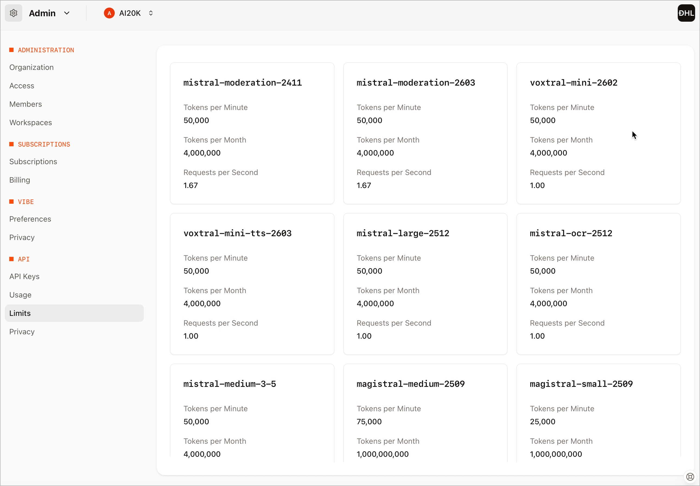
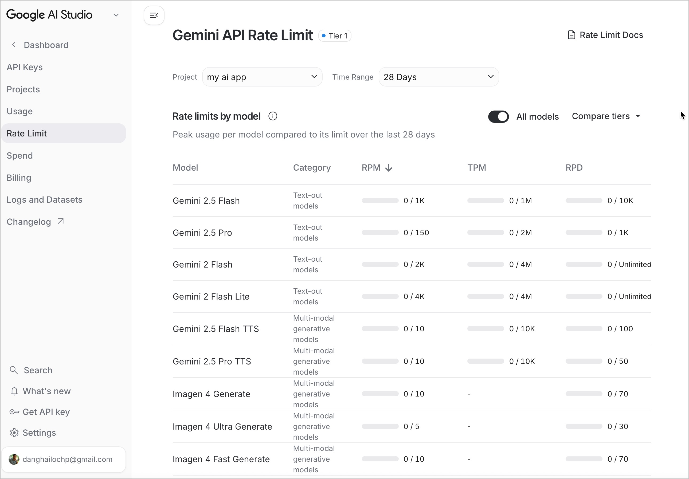
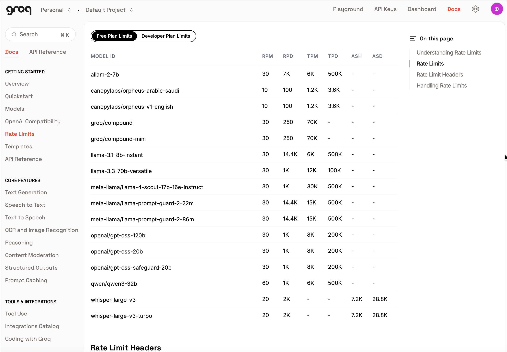
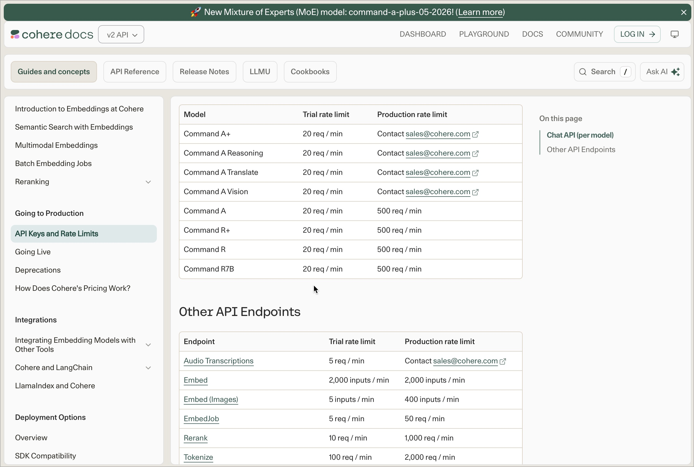
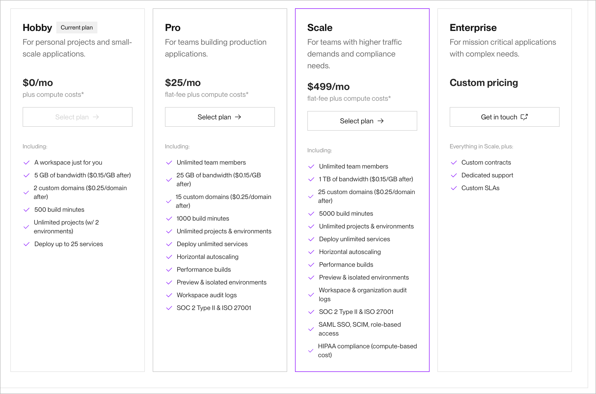
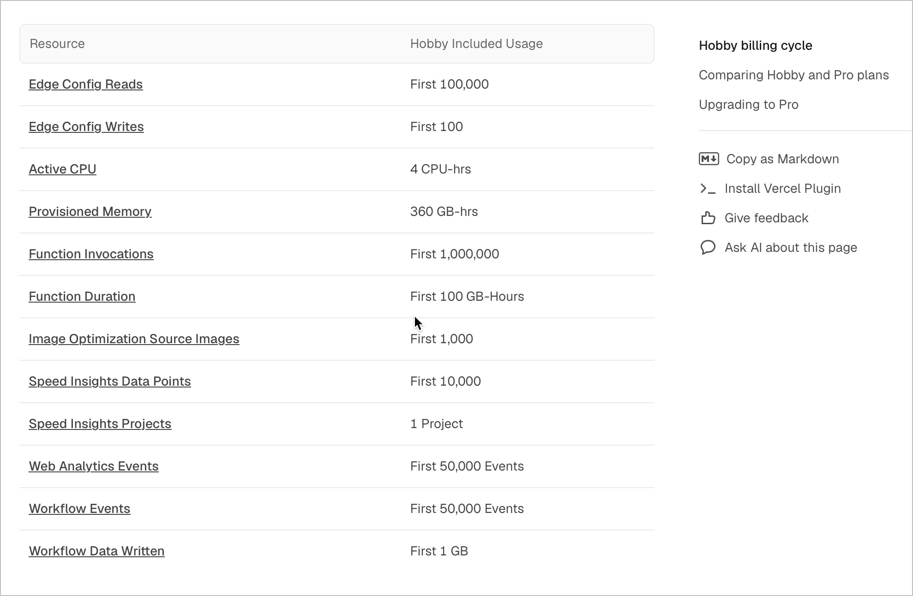
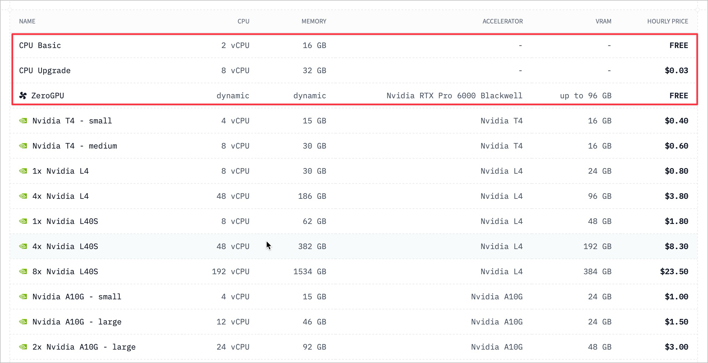
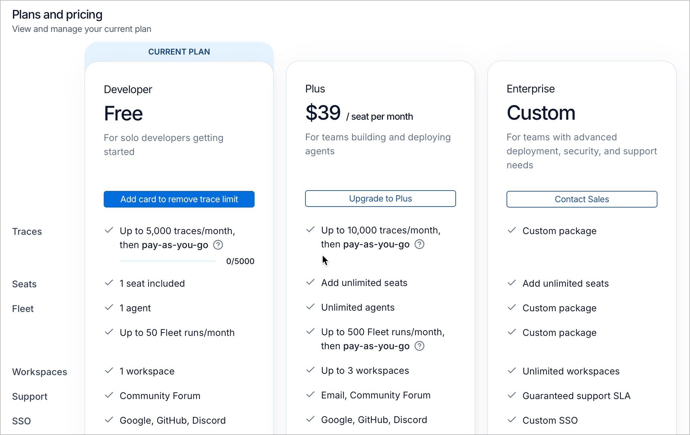

# Đăng ký tài khoản miễn phí — Bắt đầu build ứng dụng AI

Trong chương trình VinUni AI20K, các đội sẽ phải build một ứng dụng AI Agent hoàn chỉnh — từ backend (FastAPI + LangGraph), frontend (Next.js/Streamlit), database, đến deployment lên cloud. Tất cả các dịch vụ dưới đây đều có gói miễn phí (free tier) đủ dùng cho việc phát triển và demo trong 6 tuần của chương trình. Bạn **KHÔNG cần thẻ tín dụng** cho hầu hết các dịch vụ.

> ⚠️ **LƯU Ý:** Một số dịch vụ yêu cầu thẻ tín dụng để xác minh (nhưng sẽ không tính phí nếu bạn dùng trong free tier). Điều này được ghi rõ bên cạnh mỗi dịch vụ.

> 💡 **MẸO:** Đăng ký tài khoản là việc **ĐẦU TIÊN** đội nên làm trong Tuần 1. Càng sớm đăng ký, càng sớm bắt đầu code!

---

## Tổng quan Technology Stack AI20K

Trước khi đăng ký tài khoản, hãy hiểu bạn sẽ cần gì:

| Thành phần | Công nghệ | Nền tảng | Mục đích |
|------------|-----------|----------|----------|
| Backend | FastAPI + Python 3.11 | Render / Railway | API server cho AI Agent |
| AI Agent | LangGraph + LangChain | — | Xử lý logic & workflow của agent |
| LLM | GPT-4o-mini / Gemini / Mistral | OpenAI / Google / Mistral API | Bộ não AI — xử lý ngôn ngữ |
| Database | PostgreSQL + pgvector | Supabase | Lưu trữ dữ liệu & vector |
| Vector Store | ChromaDB / Pinecone / Qdrant | Self-host / Cloud | Lưu trữ embedding để tìm kiếm ngữ nghĩa |
| Frontend | Next.js / Streamlit | Vercel / Streamlit Cloud | Giao diện người dùng |
| DevOps | Docker + GitHub Actions | GitHub | Đóng gói & tự động deploy |
| Monitoring | Langfuse / LangSmith | Cloud / Self-host | Theo dõi hoạt động của AI Agent |

> 💡 **MẸO:** Template dự án (`ai20k-agent-template`) đã được setup sẵn cho stack này. Bạn chỉ cần fork về và bắt đầu code!

---

## Nhóm 1: AI/LLM APIs — Xử lý ngôn ngữ & trí tuệ nhân tạo

Đây là nhóm quan trọng nhất — LLM (Large Language Model) là "bộ não" của ứng dụng AI. Mỗi đội nên đăng ký ít nhất 2-3 provider để có lựa chọn dự phòng.

### Mistral AI — KHUYÊN DÙNG (Hào phóng nhất)

- **Gói miễn phí:** Cấp 1 TỶ token/tháng miễn phí — không cần thẻ tín dụng!
- **Models:** Truy cập TẤT CẢ model: Mistral Large, Mistral Small, Codestral, Pixtral
- **Giới hạn:** 1 request/giây, 2 request/phút, 500,000 token/phút
- **Lưu ý:** Có thể dùng data để train (có thể tắt trong Admin Console)
- **Đăng ký:** https://console.mistral.ai

> 💡 **MẸO:** Đây là gói LLM API miễn phí HÀO PHÓNG NHẤT hiện có. 1 tỷ token/tháng đủ để phát triển và demo nhiều lần. Ưu tiên đăng ký tài khoản này ĐẦU TIÊN!

### Google Gemini API — KHUYÊN DÙNG (Dễ đăng ký)

- **Gói miễn phí:** Không cần thẻ tín dụng. Lấy API key ngay trên Google AI Studio.
- **Model khuyên dùng:** Gemini 2.5 Flash: 10 RPM, ~250 request/ngày — nhanh & mạnh
- **Model cao cấp:** Gemini 2.5 Pro: 5 RPM, ~25-100 request/ngày — giới hạn thấp hơn
- **Lưu ý:** Giới hạn rate đã giảm đáng kể từ cuối 2025. Nên dùng Flash thay vì Pro.
- **Đăng ký:** https://aistudio.google.com/apikey

> 💡 **MẸO:** Chỉ cần tài khoản Google (Gmail). Lấy API key trong 30 giây. Flash model đủ mạnh cho hầu hết use case AI Agent.

### Groq API — Tốc độ cực nhanh (Dùng cho demo)

- **Gói miễn phí:** Không cần thẻ tín dụng. Truy cập tất cả model miễn phí.
- **Giới hạn:** 30 request/phút, 6,000 token/phút
- **Models:** Llama 3.x, Mixtral, Gemma, DeepSeek, Whisper (speech-to-text)
- **Mẹo:** Nếu thêm thẻ tín dụng (không cần nạp tiền) → giới hạn tăng 10x + giảm 25% giá.
- **Đăng ký:** https://console.groq.com

> 💡 **MẸO:** Groq có tốc độ inference nhanh nhất hiện nay (LPU chip chuyên dụng). Tuyệt vời cho Demo Day — response gần như tức thì!

### Cohere API — Tốt cho RAG & Search

- **Gói miễn phí:** 1,000 API calls/tháng, reset đầu mỗi tháng.
- **Giới hạn:** 20 RPM (Chat), 100 RPM (Embed), 10 RPM (Rerank)
- **Đặc biệt:** Command R+, Embed v3/v4, Rerank v3/3.5 — cực kỳ phù hợp cho ứng dụng RAG.
- **Đăng ký:** https://cohere.com

---

## Nhóm 2: Cloud Hosting — Triển khai Backend & Frontend

Bạn cần cloud hosting để deploy ứng dụng lên internet, để ban giám khảo và người dùng có thể truy cập demo.

### Render.com — KHUYÊN DÙNG CHO BACKEND

- **Gói miễn phí:** 750 giờ instance miễn phí/tháng (chia cho các service)
- **Tài nguyên:** 512 MB RAM, 0.1 CPU cho mỗi web service
- **Database:** 1 GB PostgreSQL (hết hạn sau 30 ngày, rồi xóa sau 14 ngày grace)
- **Cold start:** Service tự sleep sau 15 phút không hoạt động → mất 30-60 giây để wake up
- **Bandwidth:** 5 GB bandwidth/tháng
- **Đăng ký:** https://render.com

> 💡 **MẸO:** Deploy FastAPI backend lên Render rất đơn giản — chỉ cần kết nối GitHub repo, chọn Docker, và Render tự build + deploy. Template `ai20k-agent-template` đã có sẵn Dockerfile!

> ⚠️ **LƯU Ý:** Database miễn phí trên Render sẽ bị XÓA sau 30 ngày. Dùng Supabase (Nhóm 3) thay thế cho database lâu dài.

### Vercel — KHUYÊN DÙNG CHO FRONTEND (Next.js)

- **Gói miễn phí:** 100 GB bandwidth/tháng
- **Requests:** 1 triệu edge requests/tháng
- **Build:** 6,000 build minutes/tháng
- **Tích hợp:** Deploy tự động khi push lên GitHub
- **Đăng ký:** https://vercel.com/signup

> 💡 **MẸO:** Vercel là lựa chọn TỐT NHẤT cho Next.js frontend. Deploy chỉ mất 2 phút — kết nối GitHub repo → tự nhận Next.js → deploy xong!

### Hugging Face Spaces — FREE GPU cho AI Demo!

- **Gói miễn phí:** CPU Basic: 2 vCPU, 16 GB RAM, 50 GB disk — ngủ sau 48h không dùng
- **GPU miễn phí:** ZeroGPU: ~3.5 phút/ngày GPU compute trên NVIDIA H200!
- **Phù hợp:** Tốt nhất cho AI demo, gradio apps, streamlit apps
- **Đăng ký:** https://huggingface.co/new-space

> 💡 **MẸO:** Nếu đội cần chạy model AI nặng (Whisper, LLM local, image generation), Hugging Face Spaces là lựa chọn duy nhất có GPU miễn phí!

### Streamlit Community Cloud — Deploy Streamlit nhanh chóng

- **Gói miễn phí:** Unlimited public apps (từ public GitHub repos)
- **Tài nguyên:** 1 GB RAM (burst lên 3 GB), 2 CPU cores
- **URL:** URL dạng `your-app.streamlit.app`
- **Đăng ký:** https://streamlit.io/cloud

---

## Nhóm 3: Database & Vector Store — Lưu trữ dữ liệu

Ứng dụng AI Agent cần 2 loại lưu trữ: (1) Database truyền thống cho dữ liệu người dùng, và (2) Vector Store cho tìm kiếm ngữ nghĩa (RAG).

### Supabase — KHUYÊN DÙNG (PostgreSQL + pgvector)

- **Gói miễn phí:** 500 MB database, 500 MB RAM, 5 GB egress/tháng
- **Projects:** Tối đa 2 active projects
- **Vector Search:** Có pgvector extension — tìm kiếm vector ngay trong PostgreSQL!
- **Tính năng:** Bao gồm Auth (50K MAU), Storage (1 GB), Edge Functions (500K/tháng)
- **Lưu ý:** Tự động pause sau 7 ngày không dùng
- **Đăng ký:** https://supabase.com

> 💡 **MẸO:** Supabase là lựa chọn TỐT NHẤT cho AI20K vì: (1) PostgreSQL tương thích với template, (2) pgvector thay thế Vector Store riêng, (3) Auth sẵn có, (4) 2 projects đủ cho dev + demo.

### Pinecone — Vector Database chuyên dụng

- **Gói miễn phí:** 2 GB vector storage, 5 serverless indexes
- **Operations:** 2 triệu write units/tháng, 1 triệu read units/tháng
- **Embedding:** 5 triệu token/tháng cho embedding inference
- **Đăng ký:** https://www.pinecone.io

### ChromaDB — Self-hosted, KHÔNG GIỚI HẠN

- **Gói miễn phí:** Hoàn toàn miễn phí, open-source (Apache 2.0). Chạy local hoặc trong Docker.
- **Cài đặt:** `pip install chromadb` — chạy ngay trong Python
- **Tương thích:** Template `ai20k-agent-template` đã tích hợp sẵn ChromaDB.

> 💡 **MẸO:** ChromaDB self-hosted là lựa chọn ĐƠN GIẢN NHẤT — không cần tài khoản cloud, chạy trực tiếp trong FastAPI server. Kết hợp với Supabase để có cả database truyền thống + vector search.

### Qdrant Cloud — Vector DB miễn phí trên cloud

- **Gói miễn phí:** 1 GB RAM, 0.5 vCPU, 4 GB disk — ~250K vectors
- **Features:** Đầy đủ API (REST + gRPC), hybrid search, quantization
- **Thẻ tín dụng:** Không cần thẻ tín dụng
- **Đăng ký:** https://cloud.qdrant.io

### MongoDB Atlas — NoSQL miễn phí

- **Gói miễn phí:** 512 MB storage, 100 ops/sec, 500 connections (MIỄN PHÍ mãi mãi)
- **Vector Search:** Atlas Vector Search khả dụng trên gói M0
- **Đăng ký:** https://www.mongodb.com/cloud/atlas/register

---

## Nhóm 4: DevOps & CI/CD — Tự động hóa

### GitHub — BẮT BUỘC (Quản lý code & CI/CD)

- **Gói miễn phí:** Unlimited public repos, unlimited private repos
- **GitHub Actions:** Public repos: UNLIMITED minutes. Private repos: 2,000 phút/tháng.
- **CI/CD sẵn:** Template `ai20k-agent-template` đã có sẵn file `.github/workflows/ci.yml`

**Các bước đăng ký:**

1. Vào https://github.com/signup → tạo tài khoản (dùng email trường)
2. Fork repo `ai20k-agent-template` về tài khoản của đội
3. Invite các thành viên trong đội vào repo (Settings → Collaborators)
4. Kiểm tra GitHub Actions đã chạy (tab Actions) — CI pipeline tự test code

### Docker Hub — Lưu trữ container images

- **Gói miễn phí:** 100 pulls/giờ (đã login), unlimited public repos, 1 private repo
- **Template:** Template đã có Dockerfile + docker-compose.yml
- **Đăng ký:** https://hub.docker.com

### GitLab CI — Thay thế GitHub (nếu muốn)

- **Gói miễn phí:** 400 CI/CD phút/tháng trên shared runners, 5 GB storage
- **Self-hosted:** Self-managed runners không giới hạn minutes
- **Đăng ký:** https://gitlab.com

---

## Nhóm 5: Monitoring & Logging — Giám sát ứng dụng AI

Monitoring giúp bạn biết AI Agent đang hoạt động ra sao, có lỗi gì, và chất lượng response thế nào. Đây cũng là tiêu chí đánh giá DevOps trong Demo Day.

### Langfuse — KHUYÊN DÙNG (Open-source, unlimited)

- **Cloud miễn phí:** 50,000 traces/tháng, 2 users, 30 ngày retention
- **Self-hosted:** UNLIMITED traces, UNLIMITED users — MIT license
- **Tương thích:** Hoạt động với mọi LLM framework (LangChain, LangGraph, OpenAI SDK...)
- **Đăng ký:** Cloud: https://cloud.langfuse.com | Self-hosted: https://github.com/langfuse/langfuse

> 💡 **MẸO:** Langfuse self-hosted là lựa chọn TỐT NHẤT — không giới hạn, chạy trong Docker cùng FastAPI. 10x nhiều traces hơn LangSmith trên cloud!

### LangSmith — Chính thức từ LangChain

- **Gói miễn phí:** 5,000 traces/tháng, 1 user, 14 ngày retention
- **Ưu điểm:** Tích hợp sâu với LangChain/LangGraph (dùng trong template)
- **Đăng ký:** https://smith.langchain.com

### Phoenix by Arize — Open-source AI Observability

- **Gói miễn phí:** Hoàn toàn miễn phí, open-source. Không giới hạn.
- **Cài đặt:** `pip install arize-phoenix` — chạy local
- **Features:** Embedding visualization, drift detection, token monitoring
- **GitHub:** https://github.com/arize-ai/phoenix

### Grafana Cloud — Monitoring hạ tầng tổng quát

- **Gói miễn phí:** 3 users, 10K metrics, 50 GB logs/tháng, 50 GB traces/tháng
- **Phù hợp:** Tốt cho monitoring hạ tầng (CPU, RAM, network) — không chuyên AI
- **Đăng ký:** https://grafana.com/cloud

---

## Nhóm 6: Frontend Hosting — Giao diện người dùng

Tùy vào framework frontend đội chọn:

| Framework | Nền tảng | Gói miễn phí | Đánh giá | Ghi chú |
|-----------|----------|--------------|----------|---------|
| Next.js | Vercel | 100 GB BW, 1M requests | ⭐⭐⭐⭐⭐ | Deploy 2 phút |
| Next.js | Cloudflare Pages | Unlimited BW, 100 projects | ⭐⭐⭐⭐⭐ | BW không giới hạn |
| Streamlit | Streamlit Cloud | Unlimited public apps | ⭐⭐⭐⭐ | Chỉ cần GitHub repo |
| Static HTML | GitHub Pages | 1 GB, 100 GB BW | ⭐⭐⭐⭐ | Miễn phí, đơn giản |
| Bất kỳ framework | Netlify | 300 credits/tháng | ⭐⭐⭐ | Giới hạn mới (2025) |

---

## Nhóm 7: Domain & DNS — Tên miền

Tên miền riêng **KHÔNG BẮT BUỘC** cho Demo Day — bạn hoàn toàn có thể dùng URL miễn phí từ các cloud platform (`yourapp.vercel.app`, `yourapp.onrender.com`, `yourapp.streamlit.app`). Tuy nhiên, nếu muốn tên miền riêng cho chuyên nghiệp:

### Subdomain miễn phí (Không cần đăng ký)

| Nền tảng | Subdomain mẫu | Cách lấy |
|----------|---------------|----------|
| Vercel | `your-team.vercel.app` | Tự động khi deploy Next.js |
| Render | `your-team.onrender.com` | Tự động khi deploy FastAPI |
| Streamlit | `your-team.streamlit.app` | Tự động khi deploy Streamlit |
| GitHub Pages | `your-team.github.io` | Tự động khi tạo GitHub Pages |
| Cloudflare Pages | `your-team.pages.dev` | Tự động khi deploy |
| DuckDNS | `your-team.duckdns.org` | Dynamic DNS, cần cập nhật |

### Tên miền trả phí

- **Giá rẻ:** Porkbun.com — tên miền .xyz, .top từ $1-2/năm
- **Phổ biến:** Namecheap.com — nhiều lựa chọn, ~$2-5/năm cho TLD rẻ
- **Minh bạch:** Cloudflare Registrar — giá at-cost (không markup)

> 💡 **MẸO:** Tên miền riêng là "nice to have" — KHÔNG ảnh hưởng điểm đánh giá. Ưu tiên thời gian cho việc build app hơn!

---

## Nhóm 8: Công cụ hỗ trợ khác

### ngrok — Chia sẻ localhost cho người khác test

- **Gói miễn phí:** 1 tunnel, URL random (đổi mỗi 2 giờ), 1 GB bandwidth/tháng
- **Dùng khi:** Tốt cho test nhanh — cho teammate hoặc mentor xem app đang chạy local
- **Đăng ký:** https://ngrok.com

### Postman — Test API

- **Gói miễn phí:** Core API testing cho 1 user, 5,000 AI credits/tháng
- **Dùng cho:** Test các endpoint FastAPI (`/api/v1/chat`, `/api/v1/status`)
- **Đăng ký:** https://www.postman.com

### Figma — Thiết kế giao diện

- **Gói miễn phí:** 3 design files + 3 FigJam files, unlimited personal drafts
- **Dùng cho:** Wireframe UI/UX cho ứng dụng AI Agent
- **Đăng ký:** https://www.figma.com

### Sentry — Error tracking

- **Gói miễn phí:** 5,000 error events/tháng, unlimited projects
- **Dùng cho:** Tự động bắt lỗi trong FastAPI app, gửi alert
- **Đăng ký:** https://sentry.io

---

## FAQ — Câu hỏi thường gặp

**Q: Tôi có cần thẻ tín dụng không?**

A: Hầu hết **KHÔNG CẦN**. Mistral, Google Gemini, Groq, Together AI, Cohere, Supabase, Qdrant, Langfuse, GitHub, Docker Hub đều không yêu cầu thẻ tín dụng. Chỉ Render (cho một số tính năng) và Railway có thể yêu cầu.

**Q: Tôi nên dùng LLM nào?**

A: Khuyến nghị: Mistral (1 tỷ token free) làm chính, Google Gemini Flash làm backup, Groq cho demo cần tốc độ. Nếu template yêu cầu OpenAI cụ thể → đăng ký OpenAI và dùng GPT-4o-mini (rẻ nhất).

**Q: Free tier có đủ cho Demo Day không?**

A: CÓ. Tất cả các dịch vụ trên đều đủ cho 6 tuần phát triển + Demo Day. Lưu ý: (1) Render database miễn phí hết hạn 30 ngày — dùng Supabase, (2) OpenAI credit $5 sẽ hết nhanh nếu dùng GPT-4o — ưu tiên GPT-4o-mini hoặc Mistral.

**Q: Làm sao để tiết kiệm credit?**

A: (1) Dùng Mistral/Gemini/Groq (free) thay vì OpenAI cho development. (2) Dùng GPT-4o-mini thay vì GPT-4o khi phải dùng OpenAI. (3) Tắt debug mode khi không cần. (4) Dùng ChromaDB local thay vì Pinecone cloud. (5) Giảm token output bằng prompt ngắn gọn.

**Q: Render sleep sau 15 phút — sao cho app luôn sẵn sàng cho Demo?**

A: (1) Dùng script ping mỗi 10 phút (cron job hoặc GitHub Actions). (2) Hoặc upgrade lên paid plan ($7/tháng). (3) Hoặc deploy trên Railway/UptimeRobot. (4) Wake up thủ công trước demo 1 phút.

**Q: Nhiều người trong đội có dùng chung tài khoản được không?**

A: GitHub: Mỗi người 1 tài khoản → collaborate trên repo. Vercel/Render: 1 tài khoản đội → share login hoặc invite members. API keys: Share qua file `.env` (KHÔNG commit lên GitHub).

**Q: Template dùng OpenAI, nhưng tôi muốn dùng Mistral/Gemini — được không?**

A: ĐƯỢC! Template dùng LangChain — hỗ trợ nhiều provider. Chỉ cần thay đổi `get_llm()` trong `src/services/llm.py`. Ví dụ: `ChatMistralAI` thay vì `ChatOpenAI`. Xem hướng dẫn trong `docs/guide/chapter-04.md` của template.

**Q: Tôi có thể dùng ChatGPT Plus / Claude Pro subscription thay vì API không?**

A: KHÔNG. ChatGPT Plus / Claude Pro là subscription cho chat interface, KHÔNG phải API access. Bạn cần đăng ký API riêng (platform.openai.com, console.anthropic.com). API tính phí theo token sử dụng.

---

> 🔑 **ĐIỂM CHÍNH:** Đăng ký tài khoản trong Tuần 1, ưu tiên các dịch vụ KHUYÊN DÙNG (Mistral, Gemini, Render, Vercel, Supabase, GitHub, Langfuse). Chúc các đội xây dựng thành công ứng dụng AI! — *VinUni AI20K — Tìm Kiếm Nhân Tài Thực Chiến A.I*
